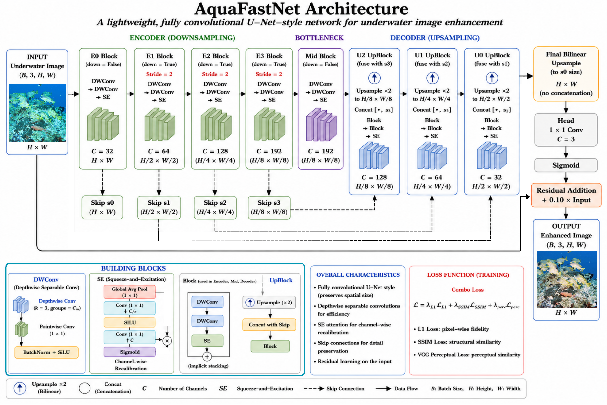
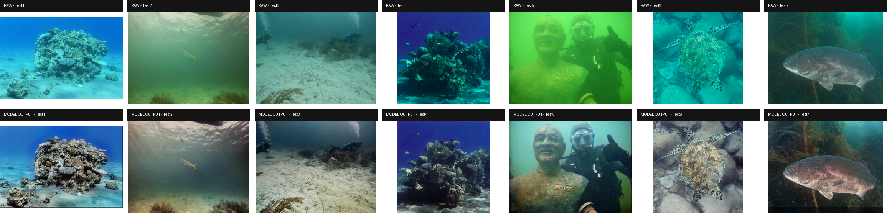

# AquaFastNet

A lightweight U-Net-style underwater image enhancer with depthwise separable convolutions, squeeze-and-excitation attention, skip fusion and residual input addition.

## Related paper and repositories

**Three Lightweight Architectures for Underwater Image Enhancement: A Quality and Efficiency Study for Real-Time Robotic Perception**
Shahid Ahamed Hasib, Farid Dinar, Yassine Zniyed, Julien Seinturier, and Nadège Thirion-Moreau. Revised manuscript, 2026.

[TinyCurveNet-CCM](https://github.com/ShahidHasib586/TinyCurveNet) · [AquaFastNet](https://github.com/ShahidHasib586/AquaFastNet) · [EdgeOSA](https://github.com/ShahidHasib586/EdgeOSA-Underwater-vsison-Enhancement)

See [paper protocol and reproducibility notes](docs/PAPER.md), [machine-readable results](results/README.md), and [citation metadata](CITATION.cff). No publication venue or DOI is claimed.

## Architecture

`uie/models.py::FastUNetEnhancer(base=32)` uses channels 3 → 32 → 64 → 128 → 192. Each block contains two depthwise separable convolutions, batch normalization/SiLU and SE recalibration. The decoder fuses the bottleneck with e3, then e2, then e1; a final bilinear resize uses e0's original spatial size. The head is 1×1 convolution + sigmoid, followed by `clamp(prediction + 0.10 * input, 0, 1)`.

The released base-32 implementation has **309,862 trainable parameters**, while Table XXIII reports **107,670**. The discrepancy is recorded in [the audit](docs/PAPER.md); pretrained-compatible channel dimensions are preserved.




## Paper-reported quality

| Evaluation set | Objective / checkpoint | PSNR ↑ | SSIM ↑ | MS-SSIM ↑ | LPIPS ↓ | NIQE ↓ |
|---|---|---:|---:|---:|---:|---:|
| UIEB test subset | L1 + SSIM + VGG perceptual | 25.27 | 0.95 | — | 0.15 | — |
| EUVP Test | L1 + SSIM + VGG perceptual | 24.32 | 0.89 | — | 0.17 | — |
| UIEB test subset | L2/MSE | 25.22 | 0.95 | — | 0.15 | — |
| EUVP Test | L2/MSE | 25.19 | 0.91 | — | 0.18 | — |

Source: Table V (rounded values). The ablation table below preserves the higher precision reported in the architecture-specific table. Validation and test rows must remain distinct.

## Paper-reported runtime

RTX 3070, 228 images, saving disabled; Tables XV–XIX.

| Measurement | Latency (ms/image) | FPS |
|---|---:|---:|
| Single-image model-only | 7.76 | 128.93 |
| Single-image standard pipeline | 78.13 | 12.80 |
| Single-image optimized pipeline | 25.44 | 39.30 |
| Batch model-only | 4.97 | 201.07 |
| Batch standard pipeline | 29.30 | 34.12 |
| Batch optimized pipeline | 12.11 | 82.53 |

## Paper-reported component ablations

Source: Table XXIII. These are manuscript results; the repository does not bundle every ablation checkpoint.

| Variant | PSNR ↑ | SSIM ↑ | LPIPS ↓ | Optimized FPS ↑ | Paper parameters |
| --- | --- | --- | --- | --- | --- |
| Without SE | 18.40 | 0.8686 | 0.2528 | 223.96 | 96414 |
| Without skips | 20.97 | 0.9009 | 0.2282 | 230.90 | 101686 |
| Without input residual | 21.10 | 0.9093 | 0.1995 | 199.68 | 107670 |
| Reduced channels | 20.11 | 0.8904 | 0.2194 | 344.04 | 30046 |
| Standard convolution | 22.80 | 0.9376 | 0.1655 | 188.24 | 779707 |
| Full composite | 25.27 | 0.9467 | 0.1520 | 39.30 | 107670 |
| Full MSE | 25.22 | 0.9456 | 0.1530 | 39.30 | 107670 |

Paper parameter counts are transcribed unchanged; they differ from the released implementation, as documented above.

## Paper-reported no-reference quality

Table XIII uses locally prepared subsets and a specific UIQM/UCIQE implementation. These scores must not be mixed with the internal scales in Table V.

| Subset | UIQM ↑ | UCIQE ↑ |
| --- | --- | --- |
| UIEB-C60 | 2.99 | 0.25 |
| EUVP-T515 | 3.29 | 0.28 |
| SQUID-T16 | 2.31 | 0.21 |
| RUIE-T78 | 2.73 | 0.21 |

Table XIV reports a separate general perceptual evaluation; its dataset labels and NIQE values are kept separate from the paired evaluation above.

| Dataset | NIQE ↓ | BRISQUE ↓ | PIQE ↓ |
| --- | --- | --- | --- |
| UIEB | 5.56 | 39.97 | 57.47 |
| EUVP | 5.88 | 35.54 | 44.38 |
| SQUID | 8.92 | 53.70 | 54.16 |
| RUIE | 5.71 | 36.90 | 51.77 |

## Setup and usage

```bash
python -m pip install -r requirements.txt
python -m pip install -r requirements-eval.txt
python -m scripts.infer_folder --in_dir /path/to/images --out_dir outputs/enhanced \
  --ckpt runs/uie_fastunet_base32/best.pt --base 32 --use_ema --device cpu
```

Use `--device cuda` for GPU inference. Running utilities with `python -m scripts...` from the repository root keeps `uie` importable.

### Training

Create CSV manifests with columns `input,gt` containing locally valid paired-image paths. Existing manifests contain the original machine's paths and must be remapped. Start separate runs for the two objectives:

```bash
python train.py --train_csv manifests/train_pairs_train.csv \
  --val_csv manifests/train_pairs_val.csv --out runs/composite \
  --base 32 --crop 256 --batch 8 --epochs 40 --lr 0.0002 --loss composite
python train.py --train_csv manifests/train_pairs_train.csv \
  --val_csv manifests/train_pairs_val.csv --out runs/mse \
  --base 32 --crop 256 --batch 8 --epochs 40 --lr 0.0002 --loss mse
```

These are runnable starting configurations, not the full historical training schedule. Training uses AdamW, cosine scheduling, AMP on CUDA and EMA validation. The default loss is L1 + 0.20 SSIM-loss + 0.05 VGG16 feature loss. `--loss mse` selects the separate MSE-only experiment; it does not change existing weights or guarantee the paper's MSE results.

### Evaluation

```bash
python -m scripts.eval_benchmark --csv manifests/test_pairs.csv \
  --ckpt runs/uie_fastunet_base32/best.pt --use_ema --device cpu
```

This utility reports PSNR; `eval_metrics.py` and `eval_all_metrics.py` offer additional legacy metrics with their own fixed crops and implementations. The latter's NIQE fallback is a proxy, not a canonical NIQE result. See [metric caveats](docs/PAPER.md). Bundled checkpoints also exist under `runs/uie_fastunet_base32_benchEUVP/`; checkpoint validation metadata must not be mistaken for a held-out test result.

## Repository contents

Training, inference, metric evaluation, original split manifests (where available), unique checkpoints, configuration examples, tests and paper-result CSVs are retained. Architecture figures and one compact qualitative preview (where available) support inspection. See [cleanup and checkpoint notes](docs/CLEANUP.md) for removed files and recovery information.

## Interpretation and limitations

Reported values are from the revised manuscript, not new measurements. Dataset splits and checkpoint selection differ across some experiments. The runtime platform was an RTX 3070 desktop GPU; embedded validation and downstream robotic-task benefits remain future work. Existing checkpoints are preserved, and their exact mapping to paper rows is not assumed. Read [the audit notes](docs/PAPER.md) before reproducing or comparing results.

## Validation

```bash
python -m unittest discover -s tests -v
```

Tests cover checkpoint compatibility, image shape/range and differentiable objectives; TinyCurveNet also checks paired augmentation alignment. They do not reproduce manuscript scores or GPU timings.

## License

Apache License 2.0. Copyright 2026 Shahid Ahamed Hasib. See [LICENSE](LICENSE).
